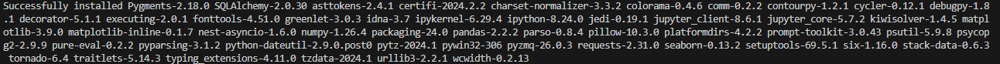

<p align="center">
  <div style="display: flex; justify-content: center; align-items: ;">
    
    
  </div>
  <h1 align="center">⚙️Videogames Data Streaming⚙️</h1>
  <p align="center"></p>
</p>

Welcome to the continuation branch of our project. This branch focuses on processing and managing data obtained by combining a clean DataFrame and a dimensional model using the Apache Kafka and Apache Airflow platforms. This work is an extension of the efforts in the previous branches, where data cleaning (EDA) tasks were performed and the dimensional model was defined.

## System Requirements 🖥️

### Docker:
- **Operating System:** Compatible with Windows, macOS, and Linux.
- **Processor:** Should be 64-bit.
- **RAM:** At least 4 GB is recommended.
- **Virtualization:** Enable virtualization in the BIOS (such as "Intel VT-x" or "AMD-V").

### Apache Kafka:
- **64-bit Processor.**
- **RAM:** At least 4 GB is recommended.
- **ZooKeeper:** Up to version 2.8.0, Kafka relied on ZooKeeper for coordination. However, starting from version 2.8.0, Kafka supports a mode without ZooKeeper dependency.
- **Docker:** Docker images for Kafka can be used.

### Apache Airflow:
- **Python:** Python must be installed on your system.
- **RAM:** At least 2 GB is recommended.
- **Operating System:** Compatible with Windows, macOS, and Linux.

**If you want to run the project on your computer, please make sure that your device is compatible with these applications. If it is not, I strongly recommend that you do not run this repository.**

## Project Structure 📃

The structure of the directories and files is as follows:

<pre>
    ├── .gitignore
    ├── README.md
    ├── docker-compose.yml
    ├── Dockerfile
    ├── requirements.txt
    ├── outputs/
    ├── plugins/
    ├── .vscode/
    │   └── settings.json
    ├── logs/
    │   └── ...
    ├── outputs/
    ├── dags/
    │   ├── __init__.py
    │   ├── dag_decorators.py
    │   ├── etl.py
    │   └── main.py
    ├── data/
    │   └── ...
    ├── docs/
    │   ├── Dashboard_proyecto.pdf
    │   ├── ETL_documentation.pdf
    │   └── Games_dashboard.pdf
    ├── notebooks/
    │   ├── eda_001.ipynb
    │   ├── eda_002.ipynb
    │   ├── eda_003.ipynb
    │   └── eda_004.ipynb
    ├── project3/
    │   └── ...
    ├── public/
    │   ├── airflow_logo.png
    │   ├── kafka_logo.png
    │   └── libraries.png
    └──  config/
        ├── database.ini
        └── dbconfig.py

</pre>


### Folders 📁
- **dags 📑:** Contains the files that will be used by the Airflow service.
- **data 📊:** Contains .csv files with the data that will be used during the project.
- **docs 📙:** Contains the documentation of the whole project, some of them talk about other branches, so take a look at them if you are interested.
- **notebooks 📚:** Contains the Jupyter notebooks with the project's performance.
- **src 📂:** Contains the ETL file that has the project's performance done in the Jupyter notebooks, but in only one Python file.

We also have other files in the root that are key to the execution of the project, i.e., without these files, the project will not run correctly.

## Installation Requirements ✔️

The required libraries are listed in the file 'requirements.txt'. Also, this file must be used to install the libraries using this command:

pip install -r requirements.txt


If installed successfully, you should have the following libraries installed:



## Project Execution 🚀

1. In a terminal, enter in a folder that you want to clone the repository:
    ```
    cd your_folder
    ```

2. Clone the repository using this command:
    ```
    git clone --branch corte3 https://github.com/juancbuitrago/ETL-Project.git
    ```

3. In the folder 'config' create a file called 'database.ini' like this:
    ```
    [postgresql]
    host=host.docker.internal
    database=games
    user=your_postgres_user
    password=your_postgres_password

4. Open a command line and execute the following command to raise the Docker service:
    ```
    docker compose up
    ```

5. Enter the airflow web server: [http://localhost:8080](http://localhost:8080). Execute the workflow.

6. In a new terminal, execute this command to access the container and create the topic:
    ```
    docker exec -it kafka-test bash
    ```
    ```
    kafka-topics --bootstrap-server kafka-test:9092 --create --topic games_stream
    ```

7. Open a new terminal, (preferably bash) and execute these commands to access into the folder with kafka producer and execute it:
    ```
    cd dags
    ```
    ```
    python producer.py
    ```

8. With the producer running, execute the kafka consumer in the same folder using this command:
    ```
    python consumer.py
    ```

## Contact 📧

If you have any questions or need further assistance, feel free to contact us:

- [dayanna.suarez@uao.edu.co](mailto:dayanna.suarez@uao.edu.co)
- [david_fel.martinez@uao.edu.co](mailto:david_fel.martinez@uao.edu.co)
- [juan_c.buitrago@uao.edu.co](mailto:juan_c.buitrago@uao.edu.co)